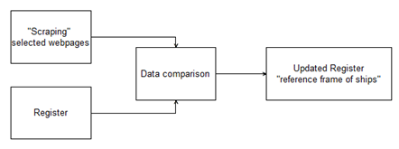
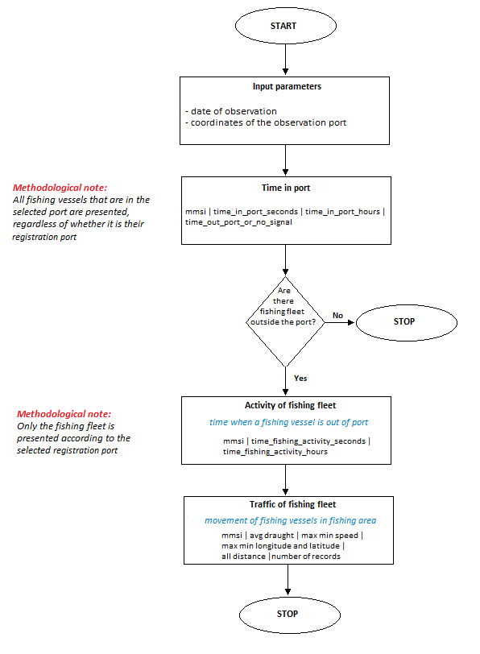

# Developer's and user's guide: Implementation of a process of traffic and activity of fishing fleet based on AIS data

## Introduction
This guide is a deliverable of the WPE Tracking ships which is part of the ESSnet Big Data II.

## Overview of process
Our general approach to developing experimental statistics on the behaviour of fishing vessels with the use of AIS data and the fishing fleet register is presented in the scheme below

  

## Overview of technology
One of the motivations in the implementation of use-case for behaviour of the fishing fleet was the full use of Big Data methods and technologies, therefore optimal solutions were selected for individual sub-processes (programming languages, libraries, tools, see diagram above). 

For the sub-processes of filtering, cleaning and processing data (responsible for generating statistics and preparing data structures for analyzes), 
we have developed algorithms in **Scala** (processed by **Apache Spark / Hadoop distributed environment**).

For the sub-processes of data visualization and analysis (including traffic intensity), we have developed **R** language codes with library for interactive maps **Leaflet**. Additionally, we have used [movingpandas](https://anitagraser.github.io/movingpandas) libraries. It is a Python library for handling movement data based on Pandas and GeoPandas. The implementation of this library allowed us to generate the traffic trajectory of the analyzed fishing fleet. 

## Data collection and preparation of a reference of frame for fishing fleet
The first step in implementing the process is to download the fishing fleet register for your country.
The fleet register, available from [website of the European Commission](http://ec.europa.eu/fisheries/fleet/index.cfm?lg=en)
and constitutes the basis to receive data on the Polish fishing fleet as of December 31st, in a reference year. 
Every EU country is obliged to report, maintain and update its country’s fishing fleet register in a unified format. 
The fishing fleet register contains a lot of valuable information, e.g.
- Country/state of registration
- Port/place of registration
- Fishing licence
- Ship’s name
- Call sign 
- Overall length
- Engine power

Based on the register, we are able to prepare a reference of frame for fishing fleet which is helpful for data filtering and limiting the size of the data set.

Each ship, regardless of type, in the AIS data is identified by the mmsi number. 
It is worth noting that all fishing vessels are required to use an AIS transmitter above 15 meters, but for safety reasons most smaller fishing vessels also use the AIS system.

Unfortunately, in many cases this number is missing in the registers.
To update/complete information that was missing, we implemented Python web scraping methods to selected tracking vessel website containing ship data. 
Information from web scraping was compared to the Register data and fishing fleet dataset was updated (see diagram below).

  

After supplementing incorrect/missing information, we can create a reference frame of Polish fishing fleets (“Register”) and were able to filter AIS data (“data filtering”), thus limiting our AIS dataset. We simply removed all information from other ships. 

Respecting the business activity of the providers of tracking vessel website solutions, we don't provide a specific solution, but only an example code - **URLscrape_example.py** that can be used to build your own code. Please note that the structure of individual pages may change over time. Of course, with a small amount of the fishing fleet, this process can be done manually.

In addition, when verifying the register of the fishing fleet, we can additionally use AIS static data (id 5) by filtering the vessel type (number 30 means fishing fleet) and selecting the country origin based on the first three characters of the mmsi number. Details in the code at **FF_reference_frame.scala**

## Data processing
The purpose of this sub-process is to generate an experimental statistic on the traffic and activity of fishing fleet based on AIS data.
The algorithm flow (**FF_data_processing.scala**) for the processing process is presented in the scheme below. 

  
 
 
Data processing may be preceded data validation as an autonomous sub-process (we recommend) or it can be done in parallel. 
To simplify the guide, validation for AIS data is implemented directly in the data processing code.
Incorrect AIS data readings, especially in terms of location (longitude, latitude), have a negative impact on the generation of distances (calculate distance) for the fishing fleet. 

For this purpose, we validated the data in the developed algorithm implementing the Haversine method, so that the distance between consecutive location points for a single route of fishing ship is not greater than half a degree, expressed in decimal notation (DD).

The algorithm requires to define by the user the input data:
- date of observation
- coordinates of observation port (rectangular shape of area, called as geo-bounding box). 

Of course, you can prepare the database of fishing ports with its geographical coordinates and retrieve required data automatically by port selection.

The first method **"Time in port"** measures the total time spent by all fishing vessels within the boundaries of the fishing port over the defined date of observation. 
From technical point of view, it means summing up all time differences between individual messages for unique MMSI (fishing vessels) in the fishing port.
As a result, we get the time expressed in seconds and hours.

The second method **"Activity of fishing fleet"** (call timeFishingActivity in code), measures the total time spent by fishing vessels at sea over a specified period.
As a result, we get the time expressed in seconds and hours for fishing vessels for which the defined port is the home port.

The third method **"Traffic of fishing fleet"** (call processing and checkDraught in code), measures the parameters of movement for active fishing fleet by port selected. 
As a result, we get the average draught, max min speed, max min longitude and latitude and all distance traveled grupy by fishing vessels (MMSI numers).

## Data visualization
