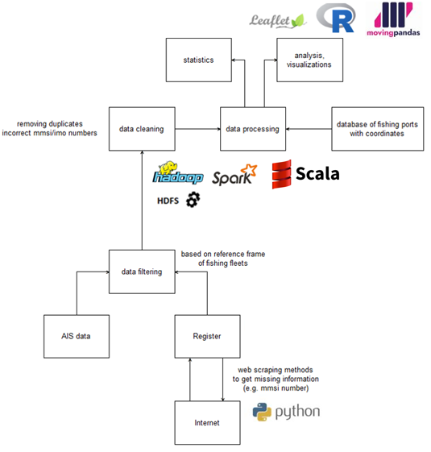

# Developer's and user's guide: Implementation of a process of traffic and activity of fishing fleet based on AIS data

## Introduction
This guide is a deliverable of the WPE Tracking ships which is part of the ESSnet Big Data II.

## Overview of process

Our general approach to developing experimental statistics on the behaviour of fishing vessels with the use of AIS data and the fishing fleet register is presented in the scheme below

  

## Overview of technology

One of the motivations in the implementation of use-case for fishing fleets was the full use of Big Data methods and technologies, therefore optimal solutions were selected for individual sub-processes (programming languages, libraries, tools, see diagram above). 

For the sub-processes of filtering, cleaning and processing data (responsible for generating statistics and preparing data structures for analyzes), 
we have developed algorithms in **Scala** (processed by **Apache Spark**).

For the sub-processes of data visualization and analysis (including traffic intensity), we have developed **R** language codes with library for interactive maps **Leaflet**. Additionally, we have used [movingpandas](https://anitagraser.github.io/movingpandas) libraries. It is a Python library for handling movement data based on Pandas and GeoPandas. The implementation of this library allowed us to generate the traffic trajectory of the analyzed fishing fleet. 

## Data collection and preparation of a reference of frame for fishing fleet

## Data processing

## Data visualization
